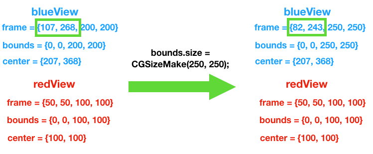

## 前言

大家都知道，frame是UIView在父view中的坐标，而bounds则是UIView的内部坐标。举个例子：


由于我们经常能在网上看见这样的源代码：

```objective-c
-(CGRect)frame{
return CGRectMake(self.frame.origin.x,self.frame.origin.y,self.frame.size.width,self.frame.size.height);
}
-(CGRect)bounds{
    return CGRectMake(0,0,self.frame.size.width,self.frame.size.height);
}
```
所以会给我们两个错觉：
* bounds.origin.x和bounds.origin.y恒等于0
* bounds.size.width恒等于frame.size.width，bounds.size.height恒等于frame.size.width
  下面这几种情况，来证明这两个错觉。

## 改变父View的bounds，父View的内部坐标偏移
我们先创建一个blueView作为父View，再创建一个redView作为子View：

到这里没有任何问题，frame和bounds表现得和我们想象的一样。接下来改变父View的bounds.origin：
```objective-c
CGRect bounds = blueView.bounds;
bounds.origin = CGPointMake(-30, -30);
blueView.bounds = bounds;
```
再次运行程序，子View向右下角发生了移动:

这是因为bounds是View的内部坐标，父View将左上角的原先的坐标原点(0，0)，改变为了刚刚设置的(-30，-30)，所以现在的坐标原点(0，0)向下偏移了，所以子View就发生了偏移：


改变父View的bounds.origin，我们可以得出结论：
* bounds.origin.x和bounds.origin.y不恒等于0
* 父View和子View的frame都不发生变化
* 父View中的内部坐标发生偏移，导致子View偏移

## 改变父View的bounds，父View的frame发生变化
同样，我们先创建好View，为了更加清晰的展示效果，将父View设在屏幕中心，子View设在父View中心：
```objective-c
blueView.center = CGPointMake(self.view.center.x, 
							self.view.center.y);
redView.center = CGPointMake(blueView.bounds.size.width/2, 
							blueView.bounds.size.height/2);
```


尝试改变父View的bounds.size:
```objective-c
CGRect bounds = blueView.bounds;
bounds.size = CGSizeMake(250, 250);
blueView.bounds = bounds;
```
再次运行程序，发现父View的center固定进行缩放。可以和改变父View的frame.size进行对比:
* 改变bounds.size:
  
* 改变frame.size:
  

这是因为改变父View的bounds.size，会使父View固定center进行缩放；改变父View的frame.size，会使父View固定frame.origin进行缩放：



改变父View的bounds.size，我们可以得出结论：
* 改变父View的bounds.size，会使父View固定center进行缩放；改变父View的frame.size，会使父View固定frame.origin进行缩放
* 不论改变bounds.size还是frame.size，子View始终保持在自己frame对应的坐标上
* 相对于屏幕，子View发生偏移

## 旋转变换
那么我们还剩下最后一个问题：bounds.size总是等于frame.size吗?
我们先来看个栗子：
在屏幕中心创建一个View
```objective-c
    UIView *blueView = [[UIView alloc] initWithFrame:CGRectMake(0, 0, 200, 200)];
    blueView.backgroundColor = [UIColor blueColor];
    blueView.center = CGPointMake(self.view.center.x, self.view.center.y);
    [self.view addSubview:blueView];
```
接着将它进行旋转变换


我们来分析一下这种情况:

frame.size如红框所示，这样就能看出与bounds.size的不同了:bounds.size代表了自身的长宽，而frame.size代表了整个轴对齐的矩形区域。我们可以通过勾股定理验证fram.size：200^2+200^2=282^2

旋转View，我们可以得出结论：
* bounds.size.width不恒等于frame.size.width，bounds.size.height不恒等于frame.size.width
* bounds.size代表了自身的长宽，而frame.size代表了整个轴对齐的矩形区域
* 旋转后frame.origin发生了变化，而bounds.origin不会发生变化(不论锚点是否在中心位置)

## 关于UIScrollView
所以当我们滑动scrollView时，scrollView的frame没有发生变化，并不是scrollView本身发生了移动，也不是subView的frame发生了变化，而是scorllView的bounds改变了，使得scrollView中的本地坐标系发生了变化，使subView发生偏移。

那么我们现在就能理解接下来这种情况了:

在有UINavigationController的UIViewController上add一个UIScrollerView，在ScrollView上的subView会发生向下的偏移，苹果这样做是为了scrollView上的subView不被navigationController遮挡：

```objective-c
    self.scrollView = [[UIScrollView alloc] initWithFrame:self.view.frame];
    [self.view addSubview:self.scrollView];
    UIView *blueView = [[UIView alloc] initWithFrame:CGRectMake(10, 10, 200, 200)];
    blueView.backgroundColor = [UIColor blueColor];
    [self.scrollView addSubview:blueView];
```

我们发现scrollView和self.view一样是从屏幕顶部开始，但是在scrollView上的subView却是从navigationController下方的(10，10)开始，而不是从屏幕下方的(10，10)开始。这是因为scrollView的bounds不是(0，0)，本地坐标系发生了偏移。我们可以在`-(void)viewDidAppear:`方法中打印出scrollView的bounds，来证明我们的猜想：
```objective-c
-(void)viewDidAppear:(BOOL)animated {
    [super viewDidAppear:animated];
    NSLog(@"scrollView bounds:%@",NSStringFromCGRect(self.scrollView.bounds));
}
```
打印结果为: scrollView bounds:

说明scrollView的左上角本地原点不再为(0，0)而是(0，-64)。


## 总结

* 如果想修改所有子View的位置，可以修改父View的bounds.origin实现；如果想修改单个View的位置，可以修改View的frame.origin
* 如果想固定center缩放View，可以修改View的bounds.size；如果想固定左上角缩放View，可以修改View的frame.size
* 修改bounds（origin或size）会影响到子View相对于屏幕的位置；修改frame（origin或size）只会影响单个View相对于屏幕的位置

